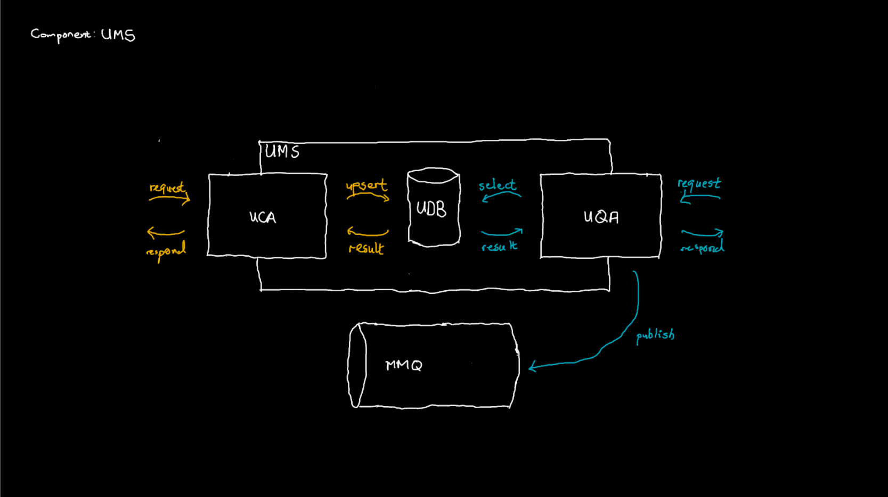
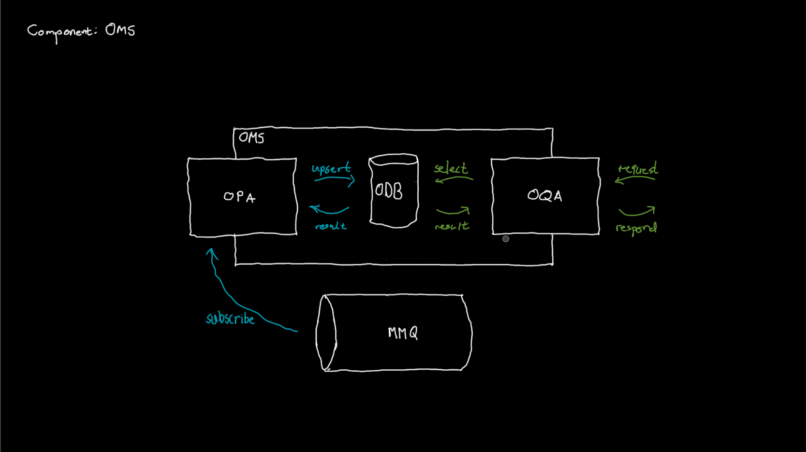

# EG MSS Architecture

## Context

* MSS: Music-Streaming Service
* Person with Microphone: Musician
* Person with Headphones: Listener
* Music Notes: Music
* Money Notes: Money

## Container

* MCP: MSS Cloud Project
* MLB: MSS Load Balancer
* UMS: Music Mico Service
* OMS: Money Micro Service
* MMQ: MMS Message Queue
* ID: Music Identifier

## Component UMS

* UCA: Music Command Application
* UQA: Music Query Application
* UDB: Music Database
* UQQ: Music Query Queue
* Yellow request: PUT Music
* Yellow upsert: upsert Music
* Yellow result: void
* Yellow respond: Music + ID
* Blue request: GET Music
* Blue select: select Music
* Blue result: maybe Music
* Blue respond: Music + ID
* Blue publish: ID

## Component OMS

* OPA: Money Persistence Application
* OQA: Money Query Application
* ODB: Money Database
* Blue subscribe: receive ID
* Blue upsert: upsert ID as 1 Money
* Blue result: void
* Green request: GET Money
* Green select: select Money
* Green result: maybe Money
* Green respond: Music ID + Money Number

## Code UCA

* Controller: Spring Rest Controller
* Service: Spring Service
* Store: R2DBC Repository
* Yellow request: PUT music
* Yellow requote: ...
* Yellow music: ...
* Yellow upsert: ...
* Yellow result: ...
* Yellow music + id: ...
* Yellow resolve: ...
* Yellow respond: ...

## Code UQA

* Skewe: CloudMQ Publishing Client
* Blue request: GET music with id
* Blue requote: ...
* Blue music: ...
* Blue upsert: ...
* Blue result: ...
* Blue music + id: ...
* Blue resolve: ...
* Blue respond: ...

## Code OPA

* Controller: CloudMQ Subscribing Client
* Service: Spring Service
* Store: R2DBC Repository
* Blue subscribe: ...
* Blue requote: ...
* Blue music id: ...
* Blue upsert: ...
* Blue result: ...
* Blue ?: ...
* Blue resolve: ...
* Blue respond: ...

## Code OQA

* Controller: Spring Rest Controller
* Service: Spring Service
* Store: R2DBC Repository
* Green request: ...
* Green requote: ...
* Green music id: ...
* Green select: ...
* Green result: maybe music
* Green maybe music: ...
* Green resolve: ...
* Green respond: ...

## Platform

* CloudPP: GCP eg-net-mss-pro, tes, int, dev
* CloudLB: External HTTP(S) Load Balancer (Global, Regional, Classic?)?
* CloudMQ: Pub/Sub
* CloudAE: App Engine
* CloudDB: CloudSQL for MySQL
* CloudLF: Cloud Function

## Contract

* Synchronous Server (Port): Spring Rest Controller
* Synchronous Client (Adapter): Spring Web Client
* Asynchronous Subscriber (Port): PubSub Subscriber
* Asynchronous Publisher (Adapter): PubSub Publisher
* Database Client (Adapter): R2DBC Repository
